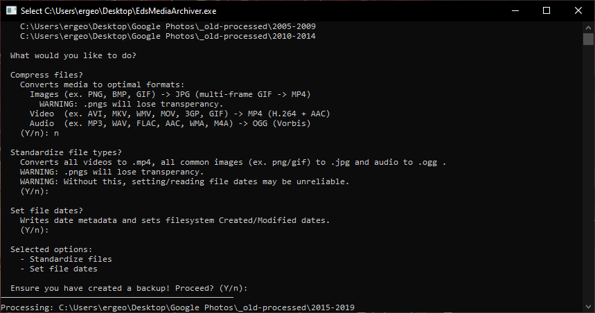

# Ed's Media Archiver

A Windows tool that prepares your media files for long-term storage. Drop files or folders onto the `.exe` and choose how to process them - compress, standardize, fix dates, or all of the above. This app processes the dropped files directly and often will delete them as it creates new ones, so **BACKUP IS VERY IMPORTANT!**

## Features

- **Compress**: Converts media to space-efficient formats:
  - Images (PNG, BMP, HEIC, AVIF, TIFF, ...) → JPG
  - Videos (AVI, MKV, WMV, MOV, 3GP, ...) → MP4 (H.264 + AAC)
  - Audio (MP3, WAV, FLAC, WMA, ...) → OGG (Opus)
  - Optional **resize** to max 1920px width/height
- **Standardize**: Normalize formats without aggressive compression (higher quality settings)
- **Set file dates**: Extracts original dates from EXIF, XMP, filenames, and filesystem metadata, then writes them back consistently
- **Fix extensions**: Detects actual file type via magic bytes and corrects mismatched extensions

Supports **70+ media formats** across images, video, and audio.

## Usage

1. Download the latest release (`EdsMediaArchiver.exe`)
2. **[FFmpeg](https://ffmpeg.org/download.html) must be installed** and available on your system PATH for video/audio processing
3. Backup the files and folders you want to process.
4. Drag and drop the files and folders you want to process onto the `.exe`
5. Answer the interactive prompts to select your options
6. Ensure you have a backup, and processing begins

Files are processed **in parallel** (up to 10 at a time) with per-file logging and a summary at the end.

> **Warning:** Compression is lossy. PNGs will lose transparency when converted to JPG.

## Building from Source

Requires [.NET 8 SDK](https://dotnet.microsoft.com/download/dotnet/8.0).

Run the publish powershell scrip to publish, the output goes to `src/bin/Release/net8.0/win-x64/publish/`.

## Contributing

Contributions are welcome! Whether it's bug fixes, new format support, or feature ideas - feel free to open an issue or submit a pull request.

Some areas that could use help:
- Transparent PNG handling (currently loses alpha on compress)
- Re-compression detection for already-compressed JPGs
- Animated GIF quality improvements
- Support for additional platforms (Linux, macOS)
