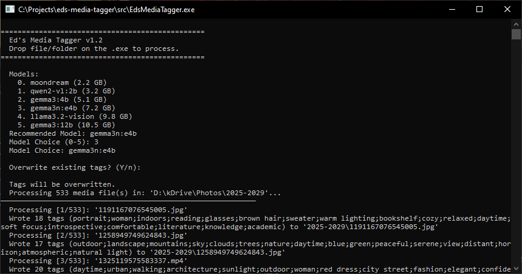

# Ed's Media Tagger

An AI-powered command-line tool that automatically generates descriptive tags for your images and videos using a local LLM, then writes them directly into the file metadata.  

It uses the **Gemma 3 12B** model via [Ollama](https://ollama.com/) to analyze media content and [ExifTool](https://exiftool.org/) to embed tags across multiple metadata standards for broad compatibility.  

**This app processes the dropped files directly, so **BACKUP IS VERY IMPORTANT!****

## Features

- Analyzes images and videos using a locally-run AI model (no cloud APIs, fully offline)
- Generates 8–20 descriptive tags covering objects, scenes, colors, activities, mood, and more
- Writes tags to multiple metadata fields (EXIF, XMP, QuickTime) for cross-platform compatibility
- Batch-processes entire directories of media files
- For videos, extracts multiple frames and deduplicates tags for better coverage
- Interactive confirmation before writing tags, you always stay in control

## Supported Formats

| Type   | Extensions                        |
|--------|-----------------------------------|
| Images | `.jpg`, `.jpeg`, `.png`, `.tiff`, `.tif` |
| Videos | `.mp4`                            |

## Prerequisites

Make sure the following are installed and available on your `PATH`:

| Dependency | Purpose | Install |
|------------|---------|---------|
| [.NET 8.0 SDK](https://dotnet.microsoft.com/download/dotnet/8.0) | Build & run the project | [Download](https://dotnet.microsoft.com/download/dotnet/8.0) |
| [Ollama](https://ollama.com/) | Local LLM server | [Download](https://ollama.com/download) |
| [ffmpeg](https://ffmpeg.org/) | Video frame extraction | `apt install ffmpeg` / `brew install ffmpeg` / [Download](https://ffmpeg.org/download.html) |
| [ExifTool](https://exiftool.org/) | Metadata writing | `apt install libimage-exiftool-perl` / `brew install exiftool` / [Download](https://exiftool.org/) |

## Usage

### Drag and drop (Windows)

Drop files or folders directly onto the compiled `.exe`.

### Workflow

1. The tool scans for supported media files
2. Each file is sent to the local Gemma 3 model for analysis
3. Generated tags are displayed in the console
4. You are prompted to confirm before tags are written (`Y/n`)
5. Approved tags are embedded into the file's metadata

Press `Ctrl+C` at any time to cancel gracefully.

## How Tags Are Stored

Tags are written to multiple metadata fields to ensure compatibility across different applications:

| Metadata Field | Compatible With |
|----------------|-----------------|
| `XPKeywords` | Windows Explorer |
| `Keywords` | General EXIF readers |
| `Subject` | Adobe Lightroom, digiKam |
| `XMP-dc:Subject` | Cross-platform (XMP standard) |
| `QuickTime:Category` | macOS / iOS |
| `Microsoft:Category` | Windows |

